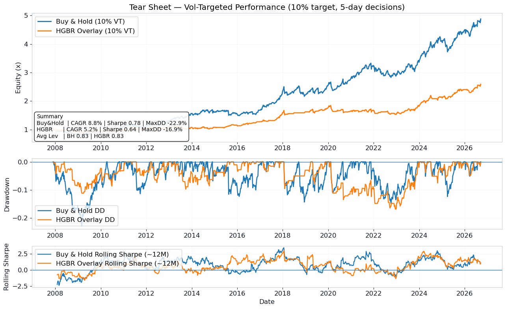

# A Regime-Aware Macro Overlay for Equity Risk Allocation

Can cross-asset macro signals improve **5-day S&P 500 (SPY) timing**?

## Summary

This project asks whether market and economic data, such as interest rates, volatility, currencies, commodities, GDP and inflation, can predict the S&P 500's return over the next week, and whether that prediction can improve on simply buying and holding.

I built a full pipeline in Python. It pulls about 20 years of daily data from Yahoo Finance and the Federal Reserve (FRED), engineers 70 features, trains and compares three machine-learning models, and backtests the signal as a trading strategy with realistic costs and risk controls.

**The result:** the signal showed promise in standard testing but did not beat buy-and-hold under a stricter, real-world test. After presenting the first version, I found and corrected three sources of look-ahead bias (the model had indirectly "seen" future data), and the corrected results are reported below. The strategy did reduce drawdowns and downside risk, mainly by holding less stock.

**Skills demonstrated**
- **Data pipeline:** Python (pandas, NumPy) with Yahoo Finance and FRED data, cleaned and aligned into one daily dataset
- **Feature engineering:** returns, volatility, momentum, yield curves, VIX term structure and macro growth rates, with release lags to avoid using data before it was public
- **Machine learning:** scikit-learn (Ridge, HistGradientBoosting, MLP), time-series cross-validation and walk-forward retraining
- **Performance and risk analysis:** Sharpe ratio, CAGR, drawdowns, VaR/CVaR, stress tests and transaction-cost sensitivity
- **Validation and self-review:** found, fixed and documented flaws in my own original results



*Buy-and-hold (blue) vs. the model-driven overlay (orange), both scaled to the same 10% volatility target. The overlay grows more slowly but has shallower drawdowns.*

---

## Key Findings (corrected)

- **Cross-validation still finds a modest signal.** Stitched out-of-sample IC is **0.088** with all features and **0.100** with features chosen inside each training fold.
- **The signal does not survive a realistic walk-forward test.** With retraining every 5 days, a 5-day purge gap and features re-selected each year from past data only, the gradient-boosting model's IC falls to **0.006**. Ridge does slightly better at **0.033**, and the MLP is about zero.
- **The overlay underperforms buy-and-hold at the same risk target.** At a 10% volatility target, the overlay's Sharpe is **0.63** versus **0.78** for buy-and-hold, with a CAGR of 5.2% versus 8.8%.
- **It does reduce drawdowns and tail risk, mainly by being out of the market more often.** Max drawdown is -16.9% versus -22.9%, and 5-day CVaR is -3.0% versus -3.9%. Realized volatility is also lower (8.3% vs 11.3%), so this is not an equal-risk improvement.
- **Recent performance is better.** Over the last five years (8% volatility target), the overlay's Sharpe is about 1.0. That is too short a period to draw conclusions from.

## What Changed After the Presentation

The first version of this analysis, presented in February 2026, reported a Sharpe ratio of about 2.1 against 0.67 for buy-and-hold. A later review found three sources of look-ahead bias in the validation. **After correcting them, the strategy no longer beats buy-and-hold.**

| Metric | As presented (original code) | Corrected |
|---|---|---|
| Walk-forward IC (HGBR) | 0.138 | **0.006** |
| Overlay Sharpe (10% vol target) | 1.89 | **0.63** |
| Buy & Hold Sharpe (10% vol target) | 0.69 | **0.78** |
| Overlay max drawdown | -7.4% | -16.9% |
| Buy & Hold max drawdown | -12.3% | -22.9% |
| Overlay CAGR | 7.4% | 5.2% |

*"As presented" is the original code re-run on the same data window (through 2026-09-29), so the only difference between the columns is the three corrections below.*

1. **Feature selection used the test period.** The original code ranked features by permutation importance across every test fold from 2008 to 2026, kept the top 25, and then trained all models on them. The walk-forward test therefore "knew" in advance which features would work. Features are now selected only from each model's own training data (inside each cross-validation fold, and re-selected about once a year in the walk-forward test).
2. **The volatility target was mis-scaled.** Volatility was calculated from 5-day returns but annualized as if they were daily, so the "10% target" actually ran at about 3.5–5%. One cell also estimated volatility from future returns. Leverage now uses 20-day realized volatility of daily SPY returns known at each decision date.
3. **Training and test data overlapped.** Each 5-day target overlaps the following week, so the last few training rows contained prices from the test period. A 5-day purge gap now separates training and test data.

The drop in walk-forward IC comes from fixes 1 and 3, which change what the model is trained on. The volatility fix changes the backtest's scaling and drawdowns, not the IC.

## Data

| Source | Series |
|---|---|
| Yahoo Finance (`yfinance`) | SPY, ES=F, NQ=F, ^IXIC, ^DJI, ^VIX, ^VIX9D, DX-Y.NYB, ^TNX, ^FVX, ^IRX, GC=F, CL=F, ^N225, MSCI |
| FRED | Real GDP (GDPC1), CPI (CPIAUCSL) |

- **Sample:** January 2005 to September 2026 (5,647 daily observations)
- **Features (70):** levels, 1/5/10-day returns, 10/20-day volatility, momentum, drawdowns, yield-curve slopes, VIX term structure, GDP and CPI growth rates, and volatility, inflation and growth regime flags
- **Macro timing:** GDP is lagged one quarter and CPI one month to approximate release delays
- **Target:** SPY forward 5-day return

Data is downloaded when the notebook runs. No raw data is stored in this repository.

## Methodology

**Models:** Ridge regression (linear baseline), HistGradientBoostingRegressor (main model), MLP (robustness check), and a 70% HGBR / 30% Ridge ensemble.

**Validation**
- `TimeSeriesSplit` (6 folds, 5-day gap), with out-of-sample predictions stitched together across folds
- Expanding-window walk-forward from 2008: retrain every 5 days on all prior data, 5-day purge gap, features re-selected about once a year from past data only
- Metrics: Spearman IC, rolling IC and regime-conditional IC

**Backtest**
- Non-overlapping 5-day holds: long SPY when the prediction is above a threshold, otherwise in cash
- 5 bps transaction cost per position change
- Volatility targeting (10% and 8%) using daily realized volatility, capped at 2x leverage
- Buy & Hold is volatility-targeted the same way for comparison
- Stress tests: 10 bps costs, 8% target, last five years
- Tear sheet: equity curves, drawdowns, rolling Sharpe, monthly return heatmap, VaR/CVaR

## Results (corrected)

### Predictive power
| Test | Ridge | HGBR | MLP |
|---|---|---|---|
| Cross-validation IC, stitched (all features) | — | 0.088 | 0.035 |
| Cross-validation IC, stitched (fold-safe top 25) | — | 0.100 | — |
| **Walk-forward IC** | **0.033** | **0.006** | -0.001 |

The gap between the cross-validation and walk-forward results is the main finding. The signal appears in large, fixed training blocks but not when the model is retrained through time using only information available at each point.

### Strategy performance (walk-forward predictions, 10% volatility target)
| | Buy & Hold | HGBR Overlay | 70/30 Ensemble |
|---|---|---|---|
| Sharpe | **0.78** | 0.63 | 0.67 |
| CAGR | **8.8%** | 5.2% | — |
| Realized volatility | 11.3% | 8.3% | — |
| Max drawdown | -22.9% | -16.9% | **-11.2%** |
| 5-day VaR / CVaR (5%) | -2.5% / -3.9% | -1.9% / -3.0% | — |
| Positive months | **63%** | 54% | — |

### Stress tests (HGBR overlay)
| Scenario | Sharpe | Max drawdown |
|---|---|---|
| Base (10% target, 5 bps) | 0.63 | -16.9% |
| 10 bps costs | 0.54 | -18.6% |
| 8% volatility target | 0.63 | -13.6% |
| Last 5 years (8% target) | 1.00 | -8.8% |

### Most frequently selected features (walk-forward)
**CPI YoY** and **VIX 5-day change** were selected in every retrain, followed by the **Dow level**, **SPY 20-day momentum**, **SPY 20-day drawdown** and **GDP YoY**.

## Limitations
- The threshold rule for each model is chosen as the best of several rules over the full backtest, which slightly favors the overlay. Even so, it trails buy-and-hold.
- GDP and CPI come from FRED's current data, which includes later revisions, and the release lags are approximate.
- VIX9D history starts in 2011, so early training windows lack VIX term-structure features.
- Results cover one asset (SPY) and one horizon (5 days).
- The optional LSTM cell is not run and does not include the corrections.

## Takeaways
- Cross-validated IC on its own overstated this signal. A true walk-forward test with feature selection inside the loop told a different story.
- Look-ahead bias can come from feature selection, not just from the data itself.
- The drawdown and tail-risk reductions are real, but they come mostly from holding less equity, not from better timing.

## Glossary
- **IC (information coefficient):** the correlation between the model's predictions and actual returns. Zero means no predictive power.
- **Sharpe ratio:** return earned per unit of risk. Higher is better.
- **CAGR:** compound annual growth rate.
- **Max drawdown:** the largest peak-to-trough loss.
- **VaR / CVaR:** the loss on a bad week (5th percentile) and the average loss beyond that point.
- **Walk-forward test:** retraining the model through time using only data available at each date, the closest simulation of real use.
- **Look-ahead bias:** when a backtest accidentally uses information that would not have been known at the time.

## Repository Structure
```
├── README.md
├── requirements.txt
├── .gitignore
├── images/
│   └── tear_sheet.png
├── notebooks/
│   └── capstone_analysis.ipynb
└── presentation/
    └── Capstone_Final_Revised.pdf
```

## How to Run
```bash
git clone https://github.com/BDan04/SP500-prediction-model.git
cd SP500-prediction-model
pip install -r requirements.txt
jupyter notebook notebooks/capstone_analysis.ipynb
```
Run all cells from top to bottom. Data downloads automatically. The FRED data needs a free API key from [fred.stlouisfed.org](https://fred.stlouisfed.org/docs/api/api_key.html), set as the `FRED_API_KEY` environment variable. The walk-forward cells retrain the models about 1,000 times, so a full run takes a while.

## Reproducibility
- **Frozen data window:** 2005-01-01 through **2026-09-29**. To use the latest data, set `END = None` in the data cell.
- **Fixed random seeds:** all models and the feature-selection permutations use seed 42.
- **Expect small differences:** Yahoo Finance recalculates historical adjusted prices after dividends, and FRED revises past GDP and CPI values, so re-running may give slightly different numbers.

## Author
**Brandon Daniels** · Capstone Project, UTSA Data Science & AI Boot Camp · 2026
[LinkedIn](https://www.linkedin.com/in/bldaniels042488)

*For research and educational purposes only. Not investment advice.*
